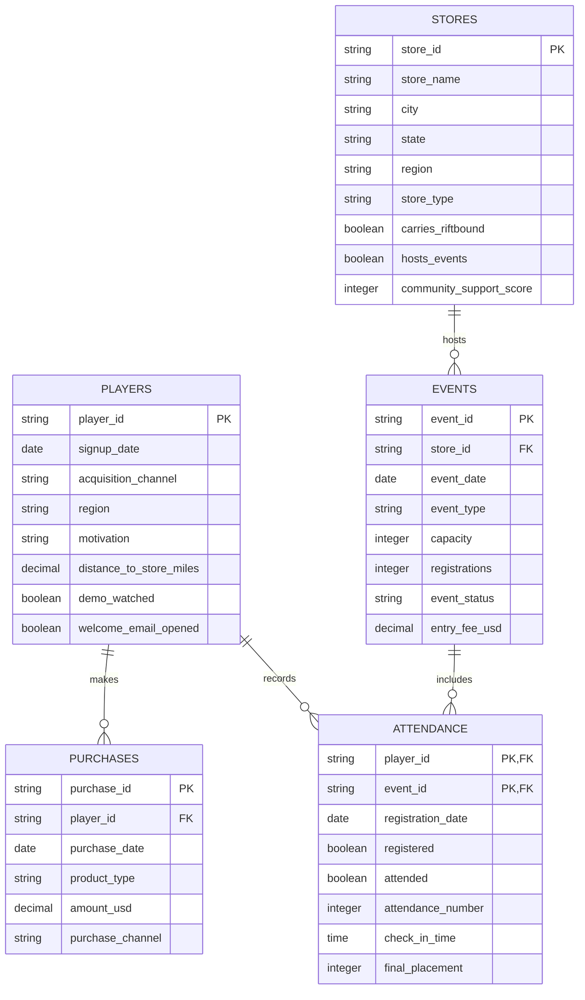

# Riftbound Player Retention Data Model

## Overview

The project uses five relational tables to model the fictional player journey
from signup through purchasing and organized-play participation.

## Relationships

### Players and purchases

One player may make zero, one, or multiple purchases. Each purchase belongs to
one player.

### Players and attendance

One player may have zero, one, or multiple attendance records. Each attendance
record belongs to one player.

### Stores and events

One store may host zero, one, or multiple events. Each event belongs to one
store.

### Events and attendance

One event may have multiple player attendance records. Each attendance record
belongs to one event.

## Analytical path

The tables support the following player journey:

1. Count new players in `players`.
2. Connect players to their first transaction in `purchases`.
3. Connect players to events through `attendance`.
4. retrieve event dates and formats from `events`.
5. retrieve store characteristics from `stores`.
6. calculate conversion and retention intervals.
